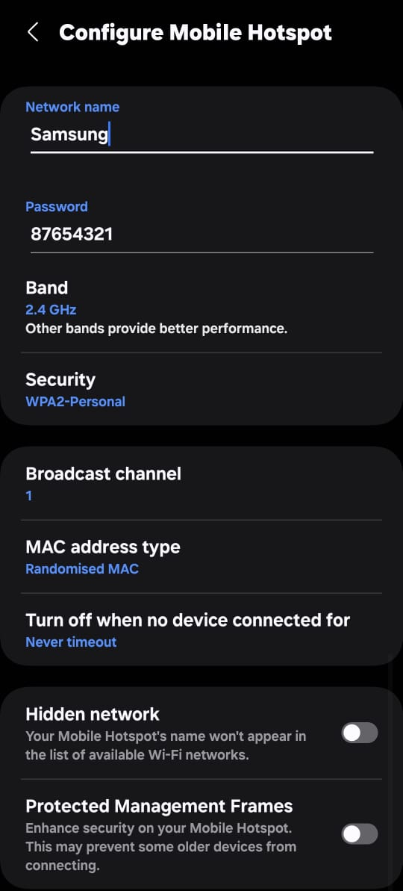
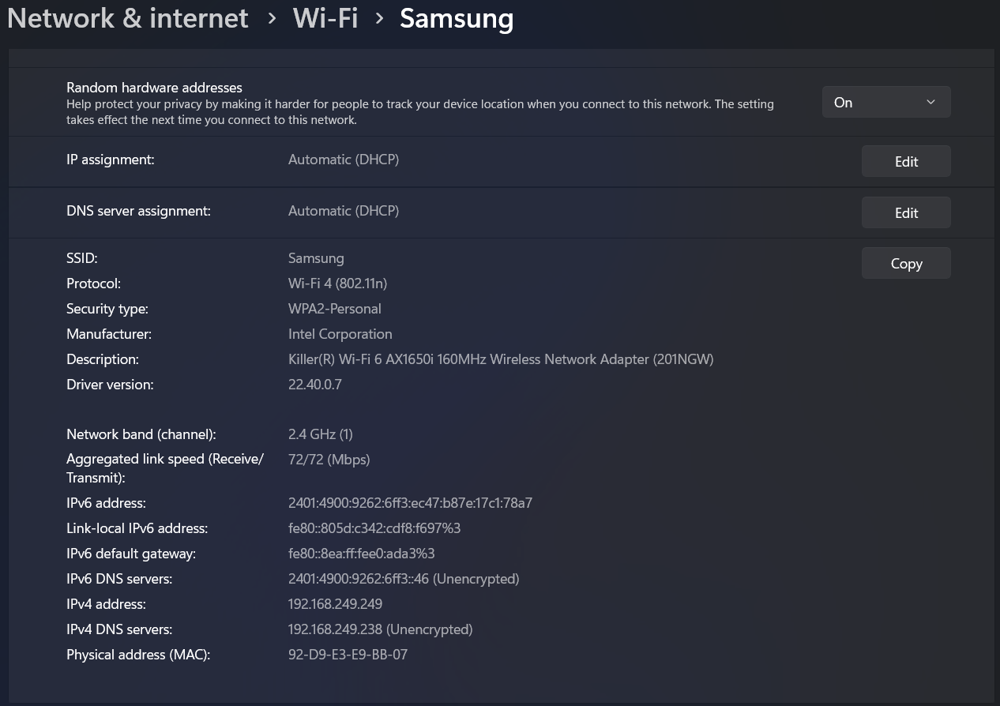
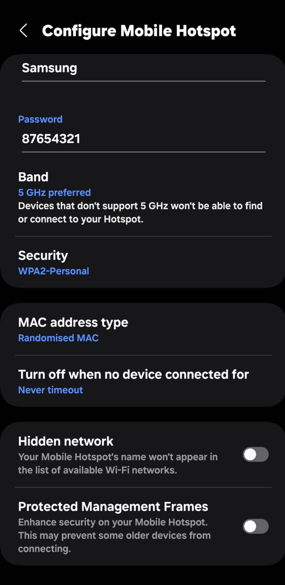
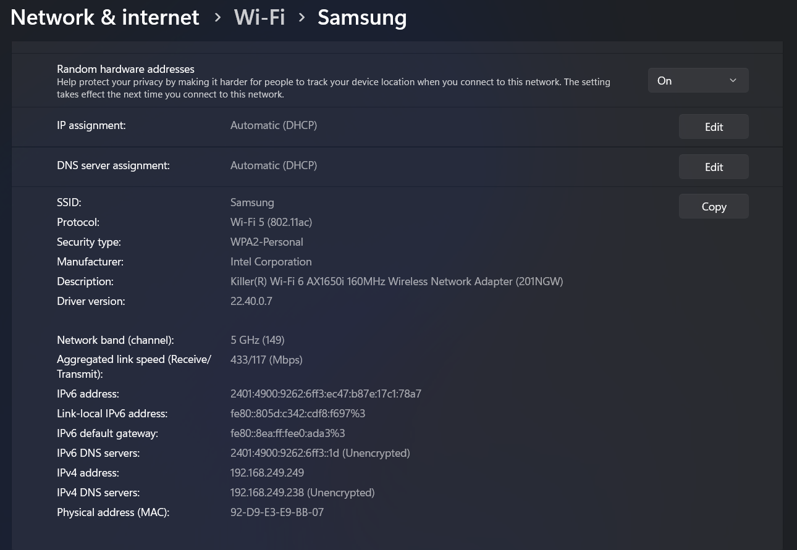

### Q7. Configure your modem/hotspot to operate only in 2.4Ghz and connect your laptop device , and capture the properties in your Wi-Fi device. Repeat the same in 5Ghz and tabulate all the differences.

```
2.4 Ghz config
--------------

    Name                   : Wi-Fi
    Description            : Killer(R) Wi-Fi 6 AX1650i 
                            160MHz Wireless Network Adapter (201NGW)
    GUID                   : 0f401918-0a1d-4c7e-881f-09b4b6a85564
    Physical address       : 92:d9:e3:e9:bb:07
    Interface type         : Primary
    State                  : connected
    SSID                   : Samsung
    AP BSSID               : 0a:ea:00:e0:ad:a3
    Band                   : 2.4 GHz
    Channel                : 1
    Network type           : Infrastructure
    Radio type             : 802.11ac
    Authentication         : WPA2-Personal
    Cipher                 : CCMP
    Connection mode        : Auto Connect
    Receive rate (Mbps)    : 433.3
    Transmit rate (Mbps)   : 433.3
    Signal                 : 88%
    Profile                : Samsung
    QoS MSCS Configured         : 0
    QoS Map Configured          : 0
    QoS Map Allowed by Policy   : 0

    Hosted network status  : Not available

```




```
5 Ghz config
-------------

 Name                   : Wi-Fi
    Description            : Killer(R) Wi-Fi 6 AX1650i 160MHz Wireless Network Adapter (201NGW)
    GUID                   : 0f401918-0a1d-4c7e-881f-09b4b6a85564
    Physical address       : 92:d9:e3:e9:bb:07
    Interface type         : Primary
    State                  : connected
    SSID                   : Samsung
    AP BSSID               : 0a:ea:00:e0:ad:a3
    Band                   : 5 GHz
    Channel                : 149
    Network type           : Infrastructure
    Radio type             : 802.11ac
    Authentication         : WPA2-Personal
    Cipher                 : CCMP
    Connection mode        : Profile
    Receive rate (Mbps)    : 433.3
    Transmit rate (Mbps)   : 433.3
    Signal                 : 82%
    Profile                : Samsung
    QoS MSCS Configured         : 0
    QoS Map Configured          : 0
    QoS Map Allowed by Policy   : 0

    Hosted network status  : Not available
```





| Parameter              | 2.4 GHz Configuration                        | 5 GHz Configuration                        |
|------------------------|---------------------------------------------|---------------------------------------------|
| **Name**              | Wi-Fi                                       | Wi-Fi                                       |
| **Adapter**          | Killer(R) Wi-Fi 6 AX1650i 160MHz            | Killer(R) Wi-Fi 6 AX1650i 160MHz            |
| **GUID**             | 0f401918-0a1d-4c7e-881f-09b4b6a85564         | 0f401918-0a1d-4c7e-881f-09b4b6a85564         |
| **Physical Address** | 92:d9:e3:e9:bb:07                           | 92:d9:e3:e9:bb:07                           |
| **Interface Type**   | Primary                                     | Primary                                     |
| **State**           | Connected                                   | Connected                                   |
| **SSID**           | Samsung                                      | Samsung                                      |
| **AP BSSID**       | 0a:ea:00:e0:ad:a3                            | 0a:ea:00:e0:ad:a3                            |
| **Band**           | 2.4 GHz                                      | 5 GHz                                       |
| **Channel**       | 1                                           | 149                                         |
| **Network Type**   | Infrastructure                               | Infrastructure                               |
| **Radio Type**     | 802.11ac                                     | 802.11ac                                     |
| **Authentication** | WPA2-Personal                               | WPA2-Personal                               |
| **Cipher**        | CCMP                                         | CCMP                                         |
| **Connection Mode** | Auto Connect                               | Profile                                     |
| **Receive Rate (Mbps)** | 433.3                                  | 433.3                                        |
| **Transmit Rate (Mbps)** | 433.3                                 | 433.3                                        |
| **Signal Strength** | 88%                                         | 82%                                         |
| **Profile**       | Samsung                                      | Samsung                                      |
| **QoS MSCS Configured** | 0                                    | 0                                           |
| **QoS Map Configured** | 0                                       | 0                                           |
| **QoS Map Allowed by Policy** | 0                              | 0                                           |
| **Hosted Network Status** | Not available                        | Not available                               |
