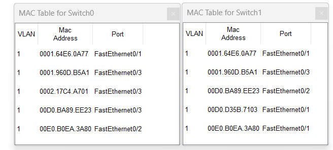
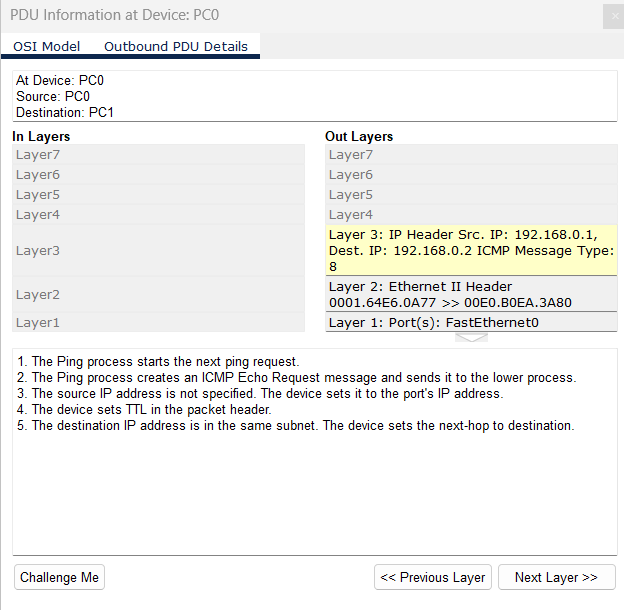
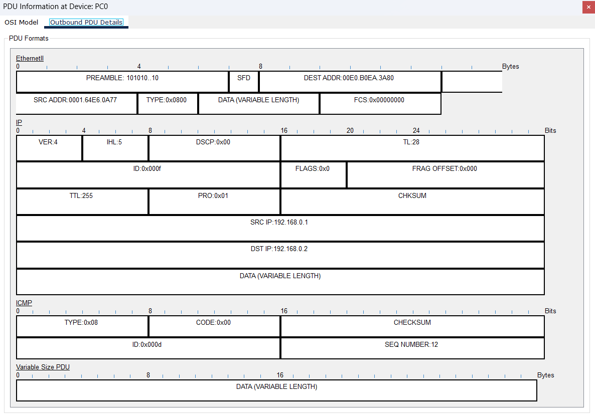

```

Question:
--------
i)   Simulate a small network with swtches and multiple devices. 
ii)  Use ping to generate traffic and observe the MAC address table of the switch. 
iii) Capture and analyze that ethernet frames.

used software:
---------------
Cisco packet tracer

Note:
-----
MAC table entries have MACs of connected switch interfaces due to the default support of STP and DTP in switches in packet tracer.

Answer:
-------
i) Simulate a small network with swtches and multiple devices: 

The topology chosen for this answer is given below
```


```
ii) Use ping to generate traffic and observe the MAC address table of the switch. 

Generated multiple PDU of ICMP packets from PC0 to PC1

```
 

```
ii) observe the MAC address table of the switches. 

```
 

```
iii) Capture and analyze that ethernet frames.

An outbound PDU of ICMP has been captured by the CPT sim-panel and its details with packet structure is given here.

```
 
