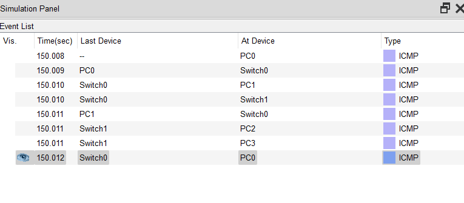

```
Question:
--------
i)   Simulate a small network with swtches and multiple devices. 
ii)  Use ping to generate traffic and observe the MAC address table of the switch. 
iii) Capture and analyze that ethernet frames.

used software:
---------------
Cisco packet tracer


Answer:
-------
i) Simulate a small network with swtches and multiple devices: 

The topology chosen for this answer is given below
```


```
ii) Use ping to generate traffic and observe the MAC address table of the switch. 

Generated multiple PDU of ICMP packets from all end devices to other

```
 