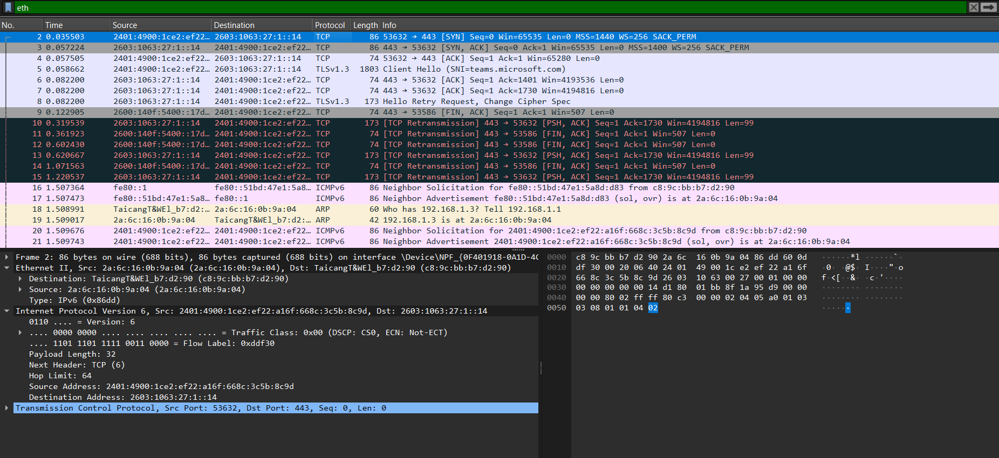

```
Question:
---------
Capture and analyse the ethernet frames using wireshark. Inspect the structure with destination src address ,
Ethertype and payload.

Ans:
----

Below is a screen shot of a TCP packet captured by the wireshark and its payload details .

```


```
Analysis:
-----------

Ethernet II, <--- ethernet type
    Src: 2a:6c:16:0b:9a:04 (2a:6c:16:0b:9a:04),
    Dst: TaicangT&WEl_b7:d2:90 (c8:9c:bb:b7:d2:90)
    Type: IPv6 (0x86dd)  <---- payload 

Internet Protocol Version 6   
    Src: 2401:4900:1ce2:ef22:a16f:668c:3c5b:8c9d
    Dst: 2603:1063:27:1::14
    Version: 6
    Traffic Class: 0x00 (DSCP: CS0, ECN: Not-ECT)
    Flow Label: 0xddf30
    Payload Length: 32
    Next Header: TCP (6)
    Hop Limit: 64
    Source Address: 2401:4900:1ce2:ef22:a16f:668c:3c5b:8c9d
    Destination Address: 2603:1063:27:1::14


Transmission Control Protocol, 
Src Port: 53632, Dst Port: 443, Seq: 0, Len: 0
    Source Port: 53632
    Destination Port: 443
    Sequence Number: 0    (relative sequence number)
    Sequence Number (raw): 2400884185
    [Next Sequence Number: 1    (relative sequence number)]
    Acknowledgment Number: 0
    Acknowledgment number (raw): 0
    Header Length: 32 bytes (8)
    Flags: 0x002 (SYN)
    Window: 65535
    [Calculated window size: 65535]
    Checksum: 0x80c3 [unverified]
    [Checksum Status: Unverified]
    Urgent Pointer: 0
    
```
