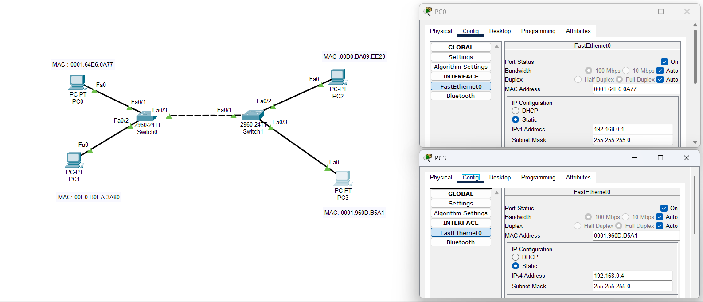

```
Question-3:
-----------

Configure static IP addresses, modify MAC addresses, and verify network connectivity using ping and ifconfig commands. 

Used software:
-------------
Cisco Packet Tracer

Used network topology:
---------------------
below is a screen shot of the devices ( PC0 and PC3 with static IPs and MAC)

```


```
Ipconfig output of PC3 and PC0:
------------------------------

PC0 ifconfig:
--------------

Cisco Packet Tracer PC Command Line 1.0
C:\>ipconfig

FastEthernet0 Connection:(default port)

   Connection-specific DNS Suffix..: 
   Link-local IPv6 Address.........: FE80::201:64FF:FEE6:A77
   IPv6 Address....................: ::
   IPv4 Address....................: 192.168.0.1
   Subnet Mask.....................: 255.255.255.0
   Default Gateway.................: ::
                                     0.0.0.0

PC3 ifconfig:
------------

Cisco Packet Tracer PC Command Line 1.0
C:\>ipconfig

FastEthernet0 Connection:(default port)

   Connection-specific DNS Suffix..: 
   Link-local IPv6 Address.........: FE80::201:96FF:FE0D:B5A1
   IPv6 Address....................: ::
   IPv4 Address....................: 192.168.0.4
   Subnet Mask.....................: 255.255.255.0
   Default Gateway.................: ::
                                     0.0.0.0


Console output of PC0 to ping PC3:
----------------------------------


C:\>ping 192.168.0.4

Pinging 192.168.0.4 with 32 bytes of data:

Reply from 192.168.0.4: bytes=32 time<1ms TTL=128
Reply from 192.168.0.4: bytes=32 time<1ms TTL=128
Reply from 192.168.0.4: bytes=32 time<1ms TTL=128
Reply from 192.168.0.4: bytes=32 time<1ms TTL=128

Ping statistics for 192.168.0.4:
    Packets: Sent = 4, Received = 4, Lost = 0 (0% loss),
Approximate round trip times in milli-seconds:
    Minimum = 0ms, Maximum = 0ms, Average = 0ms

C:\>

```