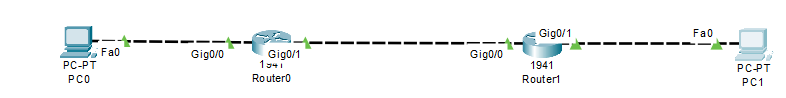

```
Question:
---------

ping from one machine to another and if the ping fails, use ifconfig to ensure the pings are configured correctly.

software used:
---------------
cisco packet tracer

Used topology:
-------------
```


```
problem:
-------

ping from pc0 to pc1 fails... 
```


```
lets use ifconfig and check if the end ip is 192.168.2.2...

below is the ipconfig output of pc1
```


```
It is found that the IP of pc1 is 192.168.2.3... thus modifying the ping command accordingly

```


```
this the ping is successfull and use of ipconfig command has been done
```