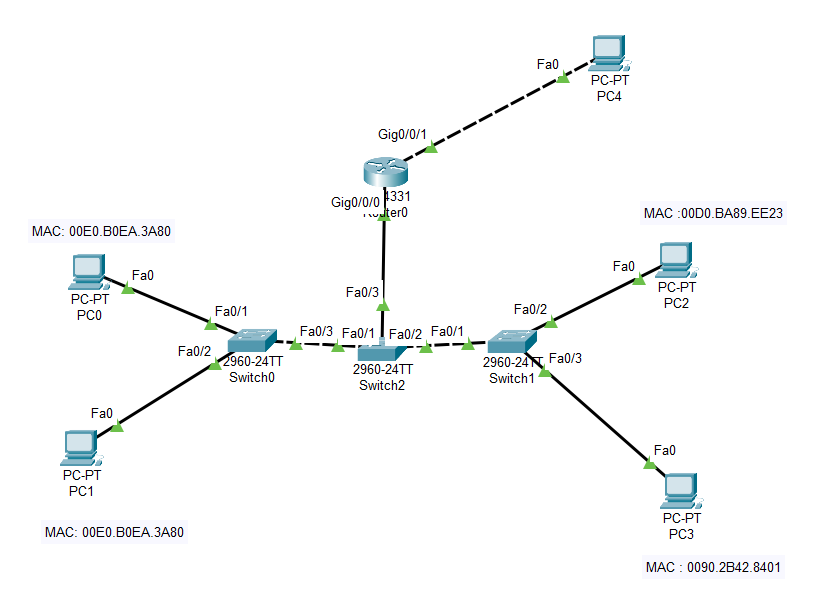

```
Question-2:
-----------
2) Using Packet Tracer. simulate an ARP spoofing attack. Analyze the behavior of devices
on the network when they receive a malicious ARP response. 

Topology used:
-------------

```


```
attacker: PC3  - IP 192.168.0.3
--------
Poisoned Arp: 192.168.0.5 's arp ( here default gateway ) 
------------
Compromised network: 192.168.0.0 (entire network since attacker poisoned the default gateway)
--------------------

Insights:
---------
we can see that pc3 (attacker) and router (default gateway ) has same MAC

```


```
Lets look at poisoned arp entries in switch MAC table... 
here instead of port 3 it has been modified as port 2 by the attacker...

```


```
from PC1 (compromised system POV)

```

```
dropped ICMP packets are follows ...
```

