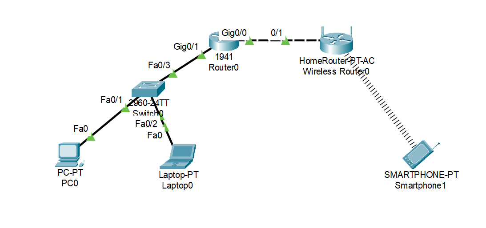
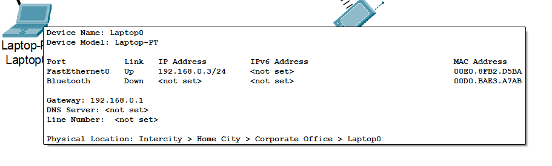
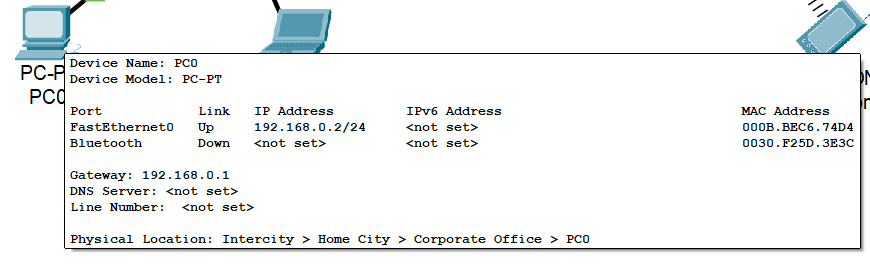
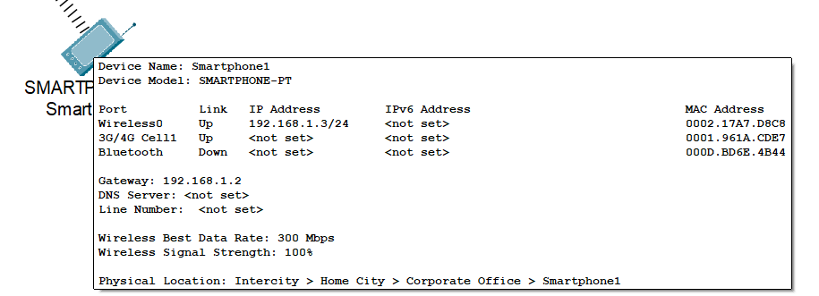
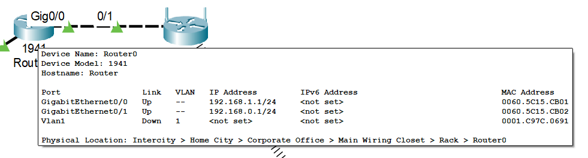
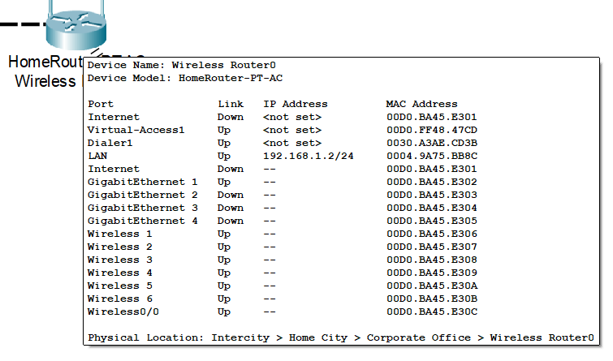

```
Question:
---------

Manually configure static IPs on the client devices PC and mobile and verify connectivity using ping

Software used:
--------------

Cisco packet tracer

Topology used:
-------------

```

```
Static Ip configration of various devices:
------------------------------------------
```






```
Ping tests between the devices with packet tracer PDU:
------------------------------------------------------

```

