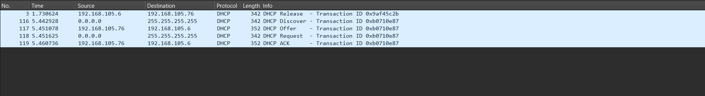

```
Question:
---------

use wireshark to capture DHCP discover , offer , Request , and Acknowledge messages and explain the process.

Note:
-----

since DHCP packets can only be captured when connecting to a DHCP server we need to flush the DHCP config through the 
following commands in windows.

i)  ipconfig /release (Release the current IP address)
ii) ipconfig /renew (Renew the IP address)

After renewing the DHCP lease we can see the captured packets here ....

```


```
Explanation of each packet:
--------------------------

Packet Breakdown (DHCP Process)

Packet 3 - DHCP Release (192.168.105.6 → 192.168.105.76)
The client (192.168.105.6) informs the DHCP server (192.168.105.76) that it is releasing its current IP address.
This happens when a client wants to disconnect or obtain a new lease.

Packet 116 - DHCP Discover (0.0.0.0 → 255.255.255.255)
The client (with no IP assigned) broadcasts a DHCP Discover message to find available DHCP servers.
This is the first step in the DHCP lease process.

Packet 117 - DHCP Offer (192.168.105.76 → 192.168.105.6)
The DHCP server (192.168.105.76) responds with a DHCP Offer, suggesting an available IP address for the client.
The offered IP is likely the same one it had before.

Packet 118 - DHCP Request (0.0.0.0 → 255.255.255.255)
The client requests the offered IP by sending a DHCP Request message.
This confirms that the client wants the specific IP assigned by the server.

Packet 119 - DHCP ACK (192.168.105.76 → 192.168.105.6)
The DHCP server acknowledges (ACK) the request, confirming that the client now owns the IP address.
The client can now use 192.168.105.6 for network communication.

```