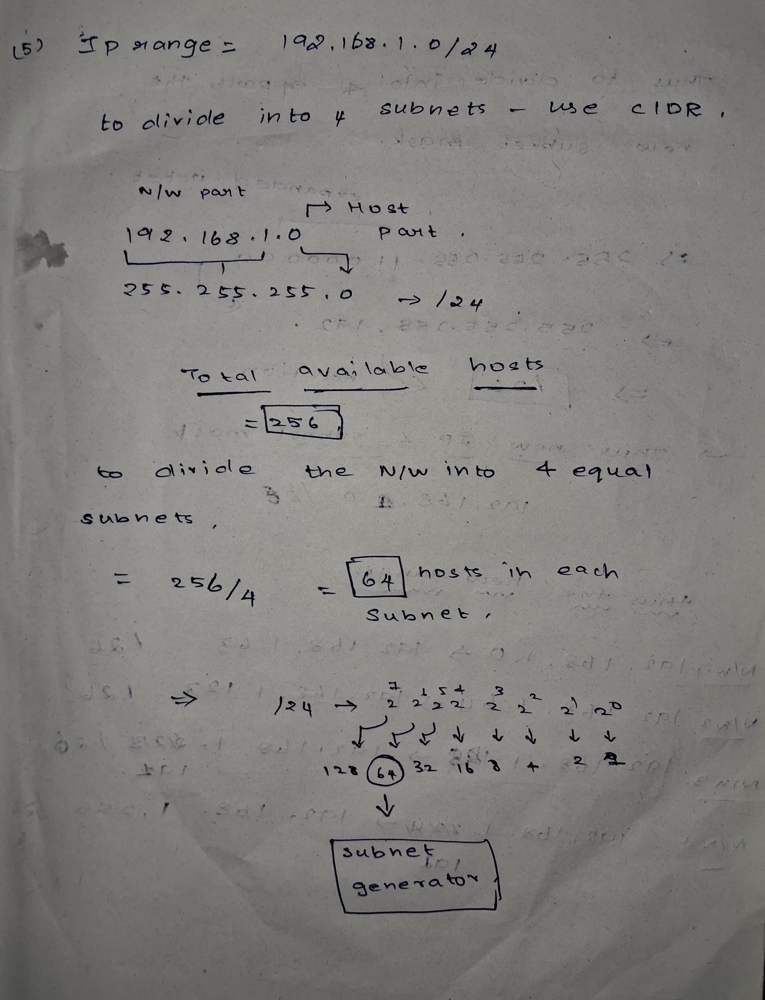
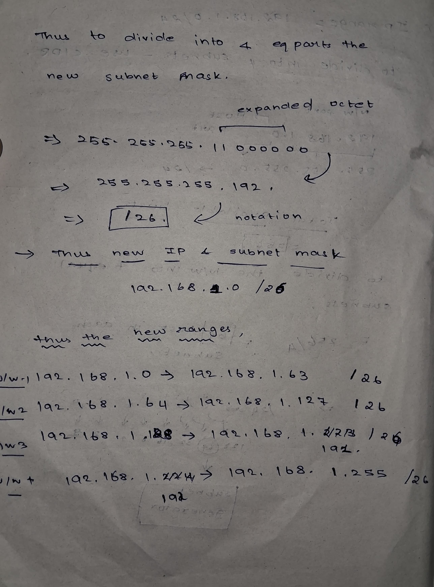
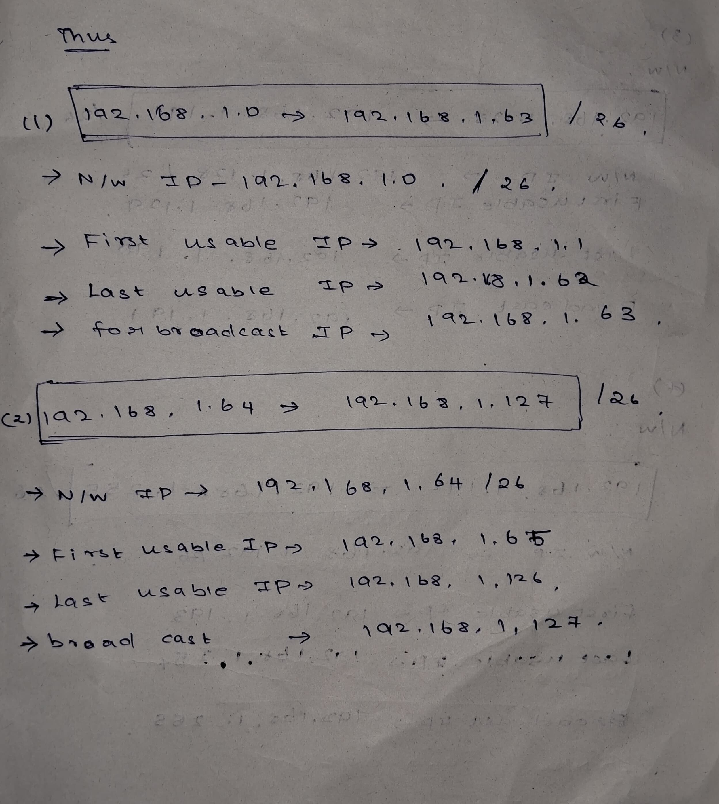
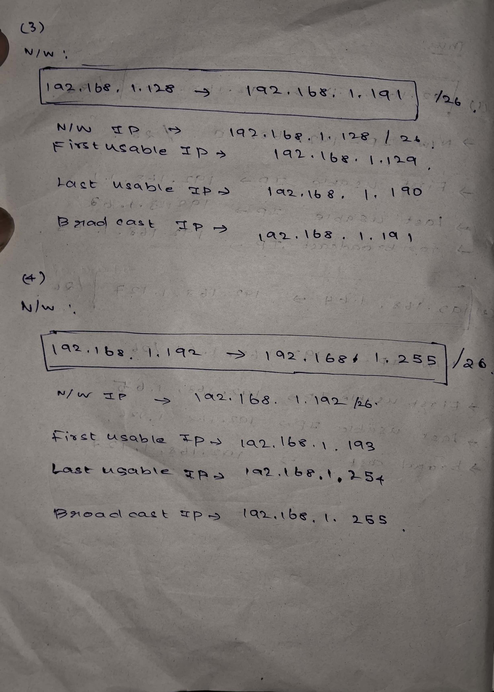

```
Question - 5:
--------------
5) Given an IP address range of 192.168.1.0/24, divide the network into 4 subnets. Task: Manually calculate the new subnet mask and the range of valid IP addresses for each subnet. 
Assign IP addresses from these subnets to devices in Cisco Packet Tracer and verify connectivity using ping between them. 

Answer:
-------

subnetting done according to the requirements is given below...
```





```
Implementaion:
-------------

Software used : Cisco packet tracer
------------

Topology:
----------
```


```
Final Ping results after implementation..
```
