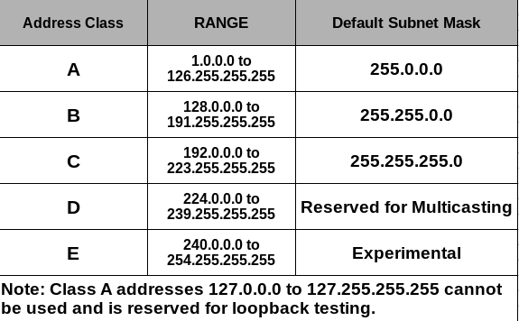

```
Question:
--------
You are given three IP addresses: 10.1.1.1, 172.16.5.10, and 192.168.1.5. Task: Identify the class of each IP address
(Class A, B, or C). What is the default subnet mask for each class? Provide the range of IP addresses for each class. 

Answer:
------
classes of IP is given below...

```


```
Below is the classic classful breakdown of each address, along with the default subnet mask and the traditional IP address ranges for each class.

1. 10.1.1.1
-----------
Class: A
Default Subnet Mask: 255.0.0.0 (or /8)
Class A Range: 1.0.0.0 to 126.255.255.255
Note: 127.0.0.0/8 is reserved for loopback (localhost) addresses.

2. 172.16.5.10
--------------
Class: B
Default Subnet Mask: 255.255.0.0 (or /16)
Class B Range: 128.0.0.0 to 191.255.255.255

3. 192.168.1.5
---------------
Class: C
Default Subnet Mask: 255.255.255.0 (or /24)
Class C Range: 192.0.0.0 to 223.255.255.255

Additional Note:
------------------
All three of these specific addresses (10.x.x.x, 172.16.x.x – 172.31.x.x, and 192.168.x.x) are in private IP ranges, commonly used in internal networks. However, the class and default mask designations above refer to the historical “classful” system. Modern networks typically use CIDR (Classless Inter-Domain Routing) to assign more flexible subnet masks.
```
