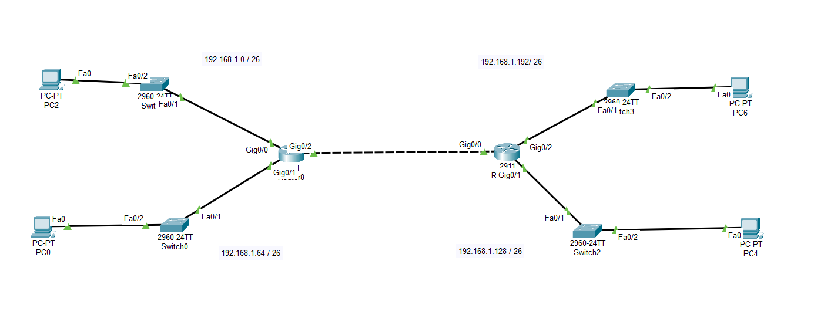

```
Question - 2:
-------------

Manually configure static routes on a router to direct packets to different subnets.
Use the ip route command and verify connectivity.

network: 192.168.0.0
--------------------

Dividing 192.168.0.0/24 into 4 Equal Subnets

When you divide a /24 network (which contains 256 addresses) into 4 equal subnets, each subnet gets 64 addresses. 
This results in a new subnet mask of /26 (since 2^(32-26)=64).

Subnet 1:
Network IP: 192.168.0.0/26
Address Range: 192.168.0.0 – 192.168.0.63
First Usable IP: 192.168.0.1
Last Usable IP: 192.168.0.62
Broadcast IP: 192.168.0.63

Subnet 2:
Network IP: 192.168.0.64/26
Address Range: 192.168.0.64 – 192.168.0.127
First Usable IP: 192.168.0.65
Last Usable IP: 192.168.0.126
Broadcast IP: 192.168.0.127

Subnet 3:
Network IP: 192.168.0.128/26
Address Range: 192.168.0.128 – 192.168.0.191
First Usable IP: 192.168.0.129
Last Usable IP: 192.168.0.190
Broadcast IP: 192.168.0.191

Subnet 4:
Network IP: 192.168.0.192/26
Address Range: 192.168.0.192 – 192.168.0.255
First Usable IP: 192.168.0.193
Last Usable IP: 192.168.0.254
Broadcast IP: 192.168.0.255


Implementaion:
-------------

Software used : Cisco packet tracer
------------

Topology:
----------
```




```
Final Ping results after implementation..
```

