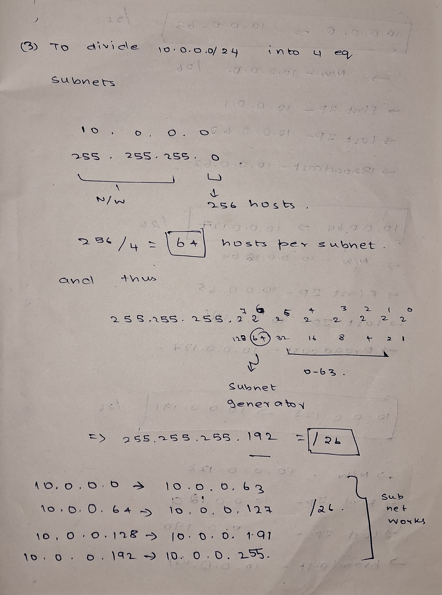
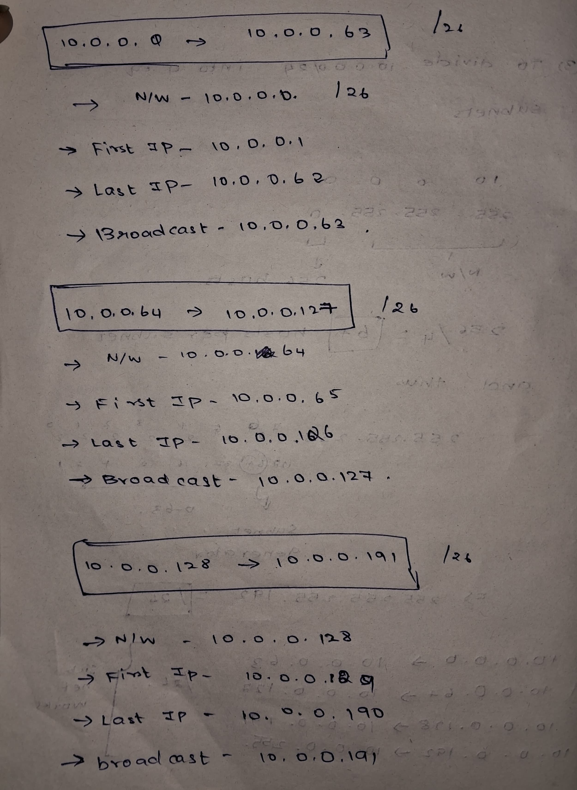
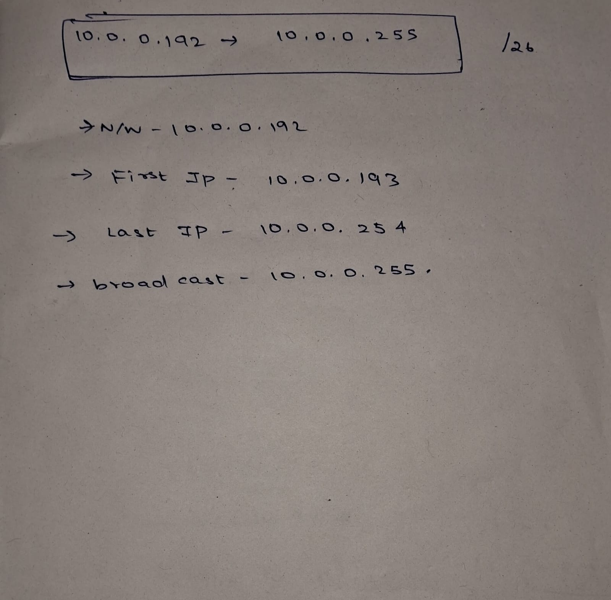
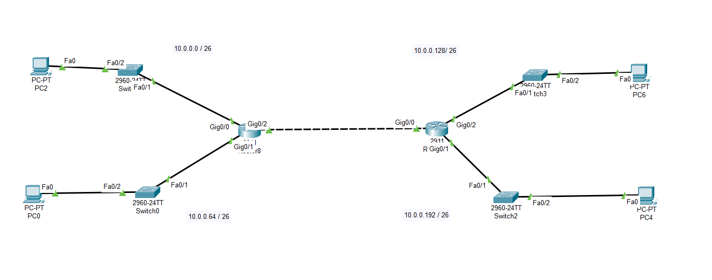
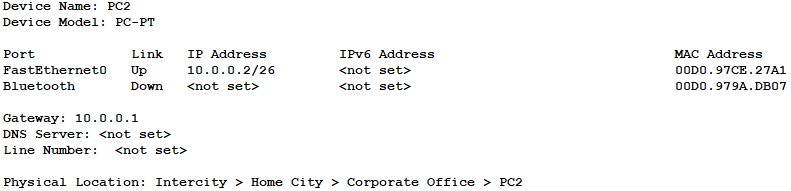
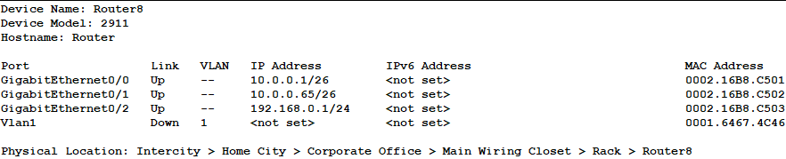
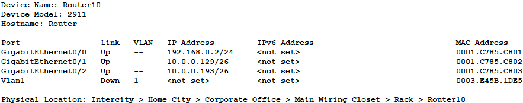
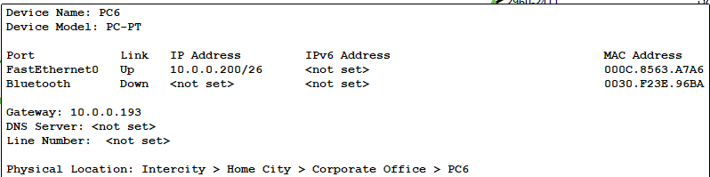
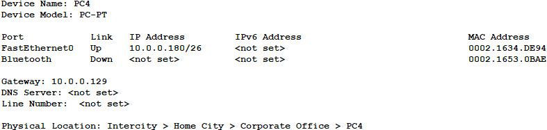
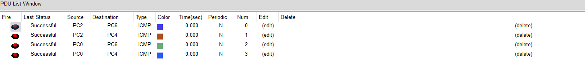

```
Question - 5:
--------------

Given a network address of 10.0.0.0/24, divide it into 4 equal subnets.
Calculate the new subnet mask.
Determine the valid host range for each subnet.
Assign IP addresses to devices in Packet Tracer and verify connectivity.

Answer:
-------

subnetting done according to the requirements is given below...
```




```
Implementaion:
-------------

Software used : Cisco packet tracer
------------

Topology:
----------
```








```
Final Ping results after implementation..
```

