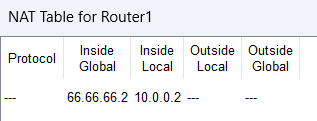

```
Question-5:
----------
In Cisco Packet Tracer, configure NAT on a router to allow internal devices (192.168.1.x) to access the internet.
Test connectivity by pinging an external public IP.
Analyze the source IP before and after NAT translation.


software used: cisco packet tracer
-------------

Network topology:
----------------
```


```
config done in router 0:
-----------------------
Router(config-if)#exit
Router(config)#interface Gig0/0
Router(config-if)#ip nat inside 
Router(config-if)#exit
Router(config)#interface Gig0/1
Router(config-if)#ip nat outside
Router(config-if)#exit
Router(config)#ip nat inside source static 192.168.0.2 55.55.55.2
Router(config)#ip nat inside source static 192.168.0.3 55.55.55.3
Router(config)#ip route 66.66.66.0 255.255.255.0 192.168.1.2

similar configration is done for router 1.

Testing:
--------

from the below figure it is evident that IP Masquerading in NAT has been achieved.
```


```
and pinging using the public IP from pc1 to pc0 and vice versa is successfull indicating the working of static NAT

From pc1:
----------

C:\>ping 55.55.55.3

Pinging 55.55.55.3 with 32 bytes of data:

Reply from 55.55.55.3: bytes=32 time<1ms TTL=126
Reply from 55.55.55.3: bytes=32 time<1ms TTL=126
Reply from 55.55.55.3: bytes=32 time=8ms TTL=126
Reply from 55.55.55.3: bytes=32 time=15ms TTL=126

Ping statistics for 55.55.55.3:
    Packets: Sent = 4, Received = 4, Lost = 0 (0% loss),
Approximate round trip times in milli-seconds:
    Minimum = 0ms, Maximum = 15ms, Average = 5ms


From PC0:
---------

C:\>ping 66.66.66.2

Pinging 66.66.66.2 with 32 bytes of data:

Reply from 66.66.66.2: bytes=32 time<1ms TTL=126
Reply from 66.66.66.2: bytes=32 time<1ms TTL=126
Reply from 66.66.66.2: bytes=32 time<1ms TTL=126
Reply from 66.66.66.2: bytes=32 time=1ms TTL=126

Ping statistics for 66.66.66.2:
    Packets: Sent = 4, Received = 4, Lost = 0 (0% loss),
Approximate round trip times in milli-seconds:
    Minimum = 0ms, Maximum = 1ms, Average = 0ms

C:\>

NAT Table:
---------
```

 
