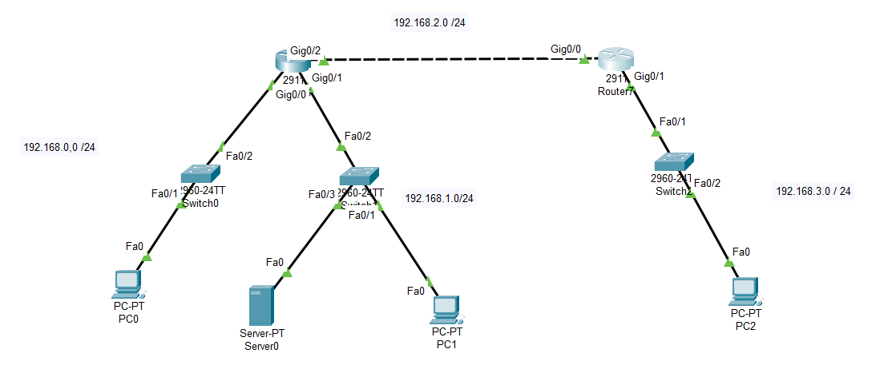

```
Question:
---------

Configure a standard Access Control List (ACL) on a router to deny traffic from a specific IP range.
Test connectivity to verify the ACL is working as intended.

Topology:
---------
```


```
config:
-------
```


```
since the standard ACL needs to be placed closer to dest the standard ACL is placed in router7 here.

in router 7 ....

Router>enable
Router#show access-lists
Standard IP access list 1
    10 deny 192.168.1.0 0.0.0.255
    20 permit any

Router#

Show ip interface in router7:

GigabitEthernet0/1 is up, line protocol is up (connected)
  Internet address is 192.168.3.1/24
  Broadcast address is 255.255.255.255
  Address determined by setup command
  MTU is 1500 bytes
  Helper address is not set
  Directed broadcast forwarding is disabled
  Outgoing access list is 1

packet captures:
---------------
the pings from 192.168.1.0 fails to 192.168.2.0 but
pings from other networks (192.168.0.0) is successfull in 192.168.2.0 due to standard ACL
```
