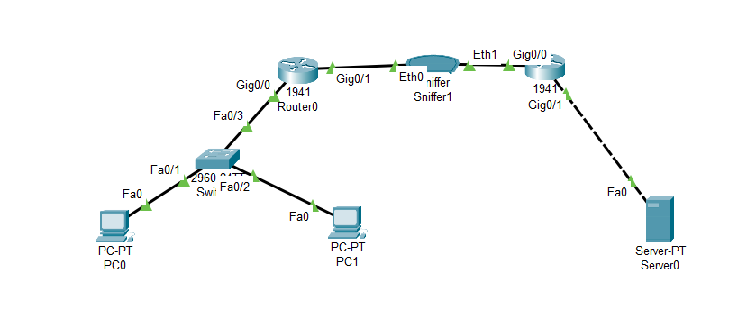
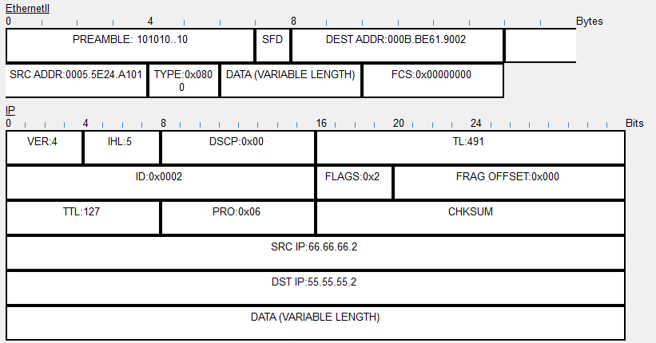
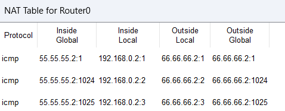
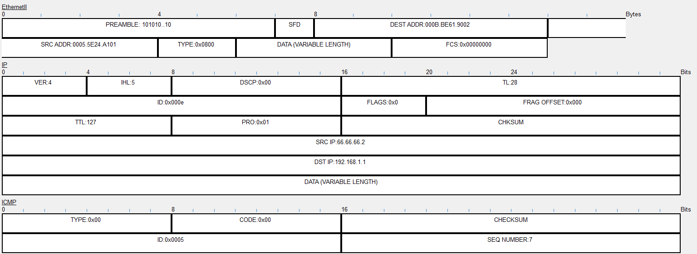
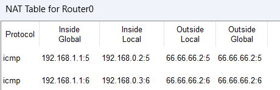
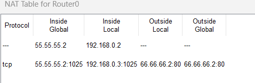
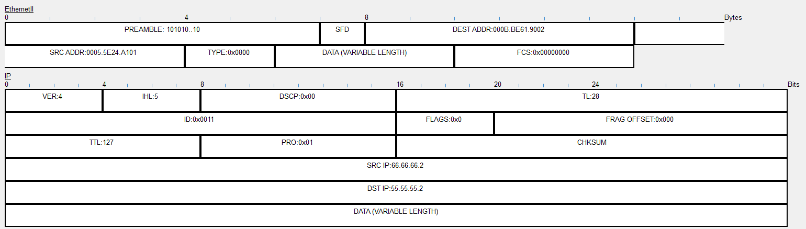

```
question 13:
------------
Try Static NAT, Dynamic NAT and PAT to translate IPs

Answer:
-------

Dynamic NAT:
----------- 

used topology...
```

```
outbound pdu with translated IP address ...
```


```
dynamic nat table of router0 ...

```



```
PAT implementation for the same network on interface Gig 0/1 ...

```



```
SNAT implementation on Gig0/1...
```

