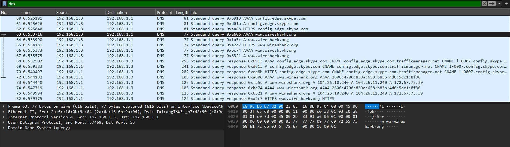

```
Question 2:
-----------

Use Wireshark to capture and analyze DNS, TCP, UDP traffic and packet header, packet flow, options and flags

i) DNS and UDP:
-------
```


```
analysis of the above dns packet..

Domain Name System (query)
    Transaction ID: 0xa606
    Flags: 0x0100 Standard querye
    Questions: 1
    Answer RRs: 0
    Authority RRs: 0
    Additional RRs: 0
    Queries
    www.wireshark.org: type AAAA, class IN   
       Name: www.wireshark.org  
       [Name Length: 17]    
       [Label Count: 3]    
       Type: AAAA (28) (IP6 Address)  
       Class: IN (0x0001)
    [Response In: 72]

User Datagram Protocol, Src Port: 57469, Dst Port: 53
    Source Port: 57469
    Destination Port: 53
    Length: 43
    Checksum: 0x8391 [unverified]
    [Checksum Status: Unverified]
    [Stream index: 4]
    [Timestamps]
    UDP payload (35 bytes)

Internet Protocol Version 4, Src: 192.168.1.3, Dst: 192.168.1.1
    0100 .... = Version: 4
    .... 0101 = Header Length: 20 bytes (5)
    Differentiated Services Field: 0x00 (DSCP: CS0, ECN: Not-ECT)
    Total Length: 63
    Identification: 0x6568 (25960)
    000. .... = Flags: 0x0
    ...0 0000 0000 0000 = Fragment Offset: 0
    Time to Live: 128
    Protocol: UDP (17)
    Header Checksum: 0x0000 [validation disabled]
    [Header checksum status: Unverified]
    Source Address: 192.168.1.3
    Destination Address: 192.168.1.1

iii) TCP packet analysis:
--------------------------

below is a sample packet capture of a followup TCP stream...

```


```
analysis:
---------

Ethernet II, Src: 2a:6c:16:0b:9a:04 (2a:6c:16:0b:9a:04), Dst: TaicangT&WEl_b7:d2:90 (c8:9c:bb:b7:d2:90)
    Destination: TaicangT&WEl_b7:d2:90 (c8:9c:bb:b7:d2:90)
    Source: 2a:6c:16:0b:9a:04 (2a:6c:16:0b:9a:04)
    Type: IPv6 (0x86dd)

Internet Protocol Version 6, Src: 2401:4900:1ce1:3414:a95b:759d:50df:5465, Dst: 2606:4700:83ba:658:b83b:4b0:5dc1:8f36
    0110 .... = Version: 6
    .... 0000 0000 .... .... .... .... .... = Traffic Class: 0x00 (DSCP: CS0, ECN: Not-ECT)
    .... 0101 1110 1000 1010 1101 = Flow Label: 0x5e8ad
    Payload Length: 32
    Next Header: TCP (6)
    Hop Limit: 64
    Source Address: 2401:4900:1ce1:3414:a95b:759d:50df:5465
    Destination Address: 2606:4700:83ba:658:b83b:4b0:5dc1:8f36

Transmission Control Protocol, Src Port: 62034, Dst Port: 443, Seq: 1, Ack: 3172, Len: 0
    Source Port: 62034
    Destination Port: 443
    [Stream index: 1]
    [Conversation completeness: Incomplete (28)]
    [TCP Segment Len: 0]
    Sequence Number: 1    (relative sequence number)
    Sequence Number (raw): 1112690073
    [Next Sequence Number: 1    (relative sequence number)]
    Acknowledgment Number: 3172    (relative ack number)
    Acknowledgment number (raw): 2004401735
    1000 .... = Header Length: 32 bytes (8)
    Flags: 0x010 (ACK)
    Window: 1022
    [Calculated window size: 1022]
    [Window size scaling factor: -1 (unknown)]
    Checksum: 0x2357 [unverified]
    [Checksum Status: Unverified]
    Urgent Pointer: 0
    Options: (12 bytes), No-Operation (NOP), No-Operation (NOP), SACK
    [Timestamps]
    [SEQ/ACK analysis]
        [TCP Analysis Flags]
        [Duplicate ACK #: 8]
        [Duplicate to the ACK in frame: 34]
    


```
