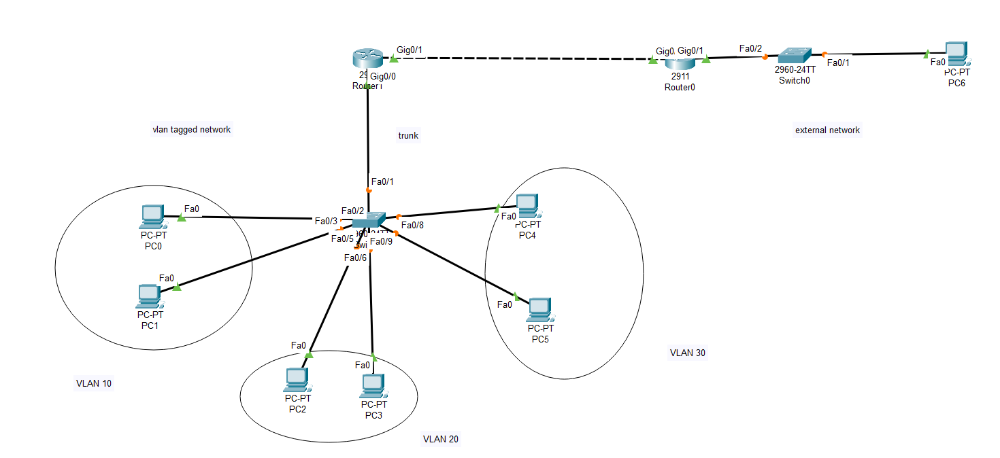

```
Question:
---------
Set up trunk ports between switches and try ping between different VLANS.

Answer:
-------
```

```
vlan config table of switch:
-----------------------------

VLAN Name                             Status    Ports
---- -------------------------------- --------- -------------------------------
1    default                          active    Fa0/10, Fa0/11, Fa0/12, Fa0/13
                                                Fa0/14, Fa0/15, Fa0/16, Fa0/17
                                                Fa0/18, Fa0/19, Fa0/20, Fa0/21
                                                Fa0/22, Fa0/23, Fa0/24, Gig0/1
                                                Gig0/2
10   VLAN0010                         active    Fa0/2, Fa0/3
20   VLAN0020                         active    Fa0/4, Fa0/5, Fa0/6
30   VLAN0030                         active    Fa0/7, Fa0/8, Fa0/9
1002 fddi-default                     active    
1003 token-ring-default               active    
1004 fddinet-default                  active    
1005 trnet-default                    active    

Switch#show interfaces trunk
Port        Mode         Encapsulation  Status        Native vlan
Fa0/1       on           802.1q         trunking      1

Port        Vlans allowed on trunk
Fa0/1       1-1005

Port        Vlans allowed and active in management domain
Fa0/1       1,10,20,30

Port        Vlans in spanning tree forwarding state and not pruned
Fa0/1       1,10,20,30

Switch#


IEEE 801.Q tagged vlan packets on trunk:
---------------------------------------

```


```
inter vlan ping results...
```

